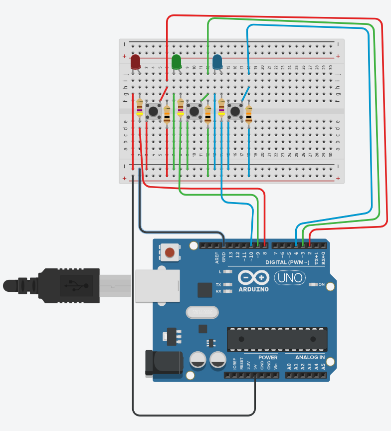

# arduino-buutons-leds

A simple Arduino project where 3 buttons control 3 LEDs using tinkercad.


---

## Components Used
- Arduino UNO
- 3x Push Buttons
- 3x LEDs
- Breadboard
- Jumper Wires
- Resistors (470Ω for LEDs)

---

## Circuit Description

Each button is connected to a digital input pin with internal pull-up enabled. When a button is pressed, the corresponding LED lights up.

- Buttons are connected to pins: `2`, `3`, `4`
- LEDs are connected to pins: `8`, `9`, `10`

---

## Arduino Code

```cpp
const int buttonPins[] = {2,3,4};   
const int ledPins[] = {8,9,10};     
const int count = 3;

void setup() {
  for(int i=0; i < count; i++){
    pinMode(buttonPins[i], INPUT_PULLUP); 
    pinMode(ledPins[i], OUTPUT);
  }
}

void loop() {
  for(int i = 0; i < count; i++){
    if (digitalRead(buttonPins[i]) == LOW) {
      digitalWrite(ledPins[i], HIGH);
    } else {
      digitalWrite(ledPins[i], LOW);
    }
  }
}
